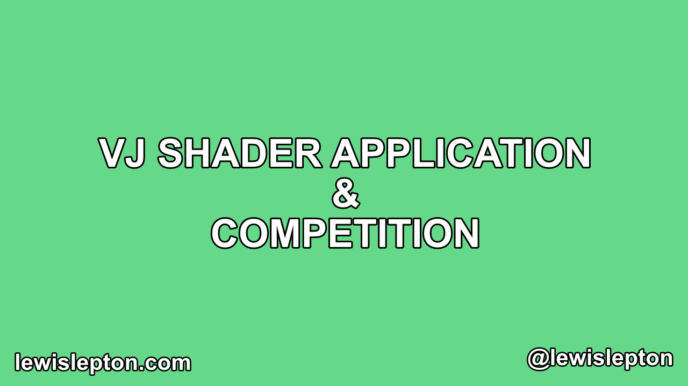

# VJ Shader

# Dependecies
- ofxShader
- ofxGui

*You do not need to use ofxShader, you can use ofShader if you really want to. You don't even have to use ofxGui if you want*

# What is this?

A VJ shader application that uses some really nice & simple tricks to get an effective result.

This project has 2 screens. One is a settings window, the other is for projecting what you have setup in the settings window. Whether that be a secend screen or projector

Until the 24th May 2020, there is a competition for people to edit this VJ application & create something really interesting, using the things we had learned thru the [openFrameworks tutorial series](https://github.com/lewislepton/openFrameworksTutorialSeries). Please watch the video above & follow the instructions.

Winners will be posted on here, so people can get to see the really nice things they have made

Have phün & enjoy making cool things

xxxxxx

[Lewis Lepton](https://lewislepton.com)